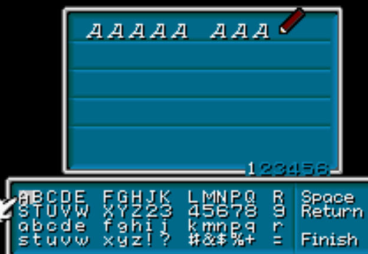
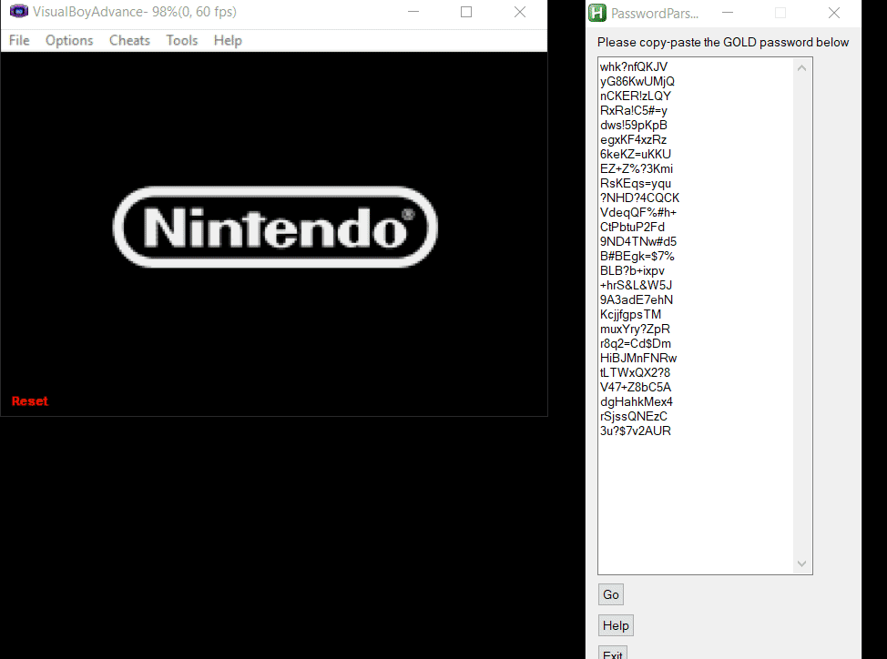

# Gs2Pass
This AutoHotKey script (v1.1.29.01) automates the tedious 260-character-long password input for Golden Sun 2: The Lost Age GameBoyAdvance game.

## Requirements
This script works with AutohotKey(http://ahkscript.org/download/) and VisualBoyAdvance GBA emulator on Windows 7 & above. The ROM for Golden Sun 2 can only be kept for 24hrs legally though...

## Building DLL
DLL can be compiled through the `.sln` file found in `msvc_dll`. If you don't wanna open Visual Studio, you can also run `msbuild` inside `cmd.exe` but first you run `vcvarsall.bat x86` to setup 32-bit build environment inside terminal.
* make sure `<path leading to Microsoft Visual Studio 14.0>\VC` is in your path environment variable for `vcvarsall.bat`

## Usage
#### Setup
##### VisualBoyAdvance emulator options
* Under `Options`->`Frame Skip`, make it `0` and disable `automatic throttling`.
* Under `Options`->`Video`, make window 2x or 3x bigger (just for better visuals)
* Under `Options`->`Joypad`->`Configure`->`1...`, make sure directions are mapped to arrow keys (should be default) and that GBA's `A` button is mapped to keyboard's `X`

To use: after installing AHK, VisualBoyAdvance emulator, obtaining the ROM file, and building the DLL, open the 'pass.ahk' file. Then, open the emulator and load the Golden Sun 2 rom and navigate to the password input screen (like the picture shown below).

##### Password input screen

Copy the contents of the 'GS2SamplePass.txt' into the textbox and click 'Go'.
* to stop the script in the middle, right-click the AHK icon in quick-launch bar and either `Reload` or `Exit`.

##### Sample password
This Gold password gives you all unlockable side quest events, Djinns, and end-game items from first Golden Sun game.

> whk?nfQKJV
> yG86KwUMjQ
> nCKER!zLQY
> RxRa!C5#=y
> dws!59pKpB
> egxKF4xzRz
> 6keKZ=uKKU
> EZ+Z%?3Kmi
> RsKEqs=yqu
> ?NHD?4CQCK
> VdeqQF%#h+
> CtPbtuP2Fd
> 9ND4TNw#d5
> B#BEgk=$7%
> BLB?b+ixpv
> +hrS&L&W5J
> 9A3adE7ehN
> KcjjfgpsTM
> muxYry?ZpR
> r8q2=Cd$Dm
> HiBJMnFNRw
> tLTWxQX2?8
> V47+Z8bC5A
> dgHahkMex4
> rSjssQNEzC
> 3u?$7v2AUR

Tool in action:

